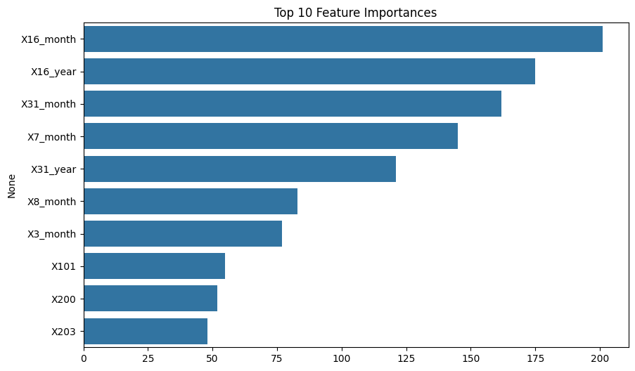
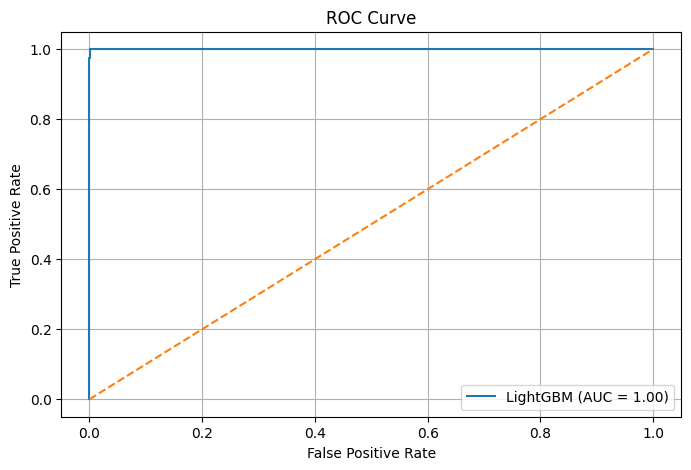

# 🧠 Customer Churn Prediction Report

This project focuses on predicting customer churn using a large and complex dataset with 167,020 records and 215 features. I performed extensive preprocessing, trained multiple models, and selected the best-performing one for deployment.

---

## 📊 Dataset Summary

* **Total Rows**: 167,020
* **Total Features**: 215
* **Target Variable**: `Target_ChurnFlag`
* **Numeric Features**: 185
* **Categorical Features**: 29
* **Date Columns**: 12
* **Completely Missing Columns Dropped**: `X11`

### Categorical Cleanup

* Columns like `X0` (lease term) had inconsistent labels (e.g., `14month lease`, `14 month lease`, etc.), which were standardized.
* Various occupation and location-related fields had inconsistent or misspelled entries (e.g., `Full time homemaker`, `Medical / Healthcare`, etc.) which were harmonized.

---

## 🧹 Data Preprocessing

* **Missing Value Handling**:

  * Numeric columns filled using median imputation.
  * Categorical columns cleaned and label encoded.
* **Date Columns**:

  * Extracted `year` and `month` from multiple date columns like `X16`, `X170`, `X2`, etc.
* **Feature Engineering**:

  * Label encoding for all categorical features.
  * One column `X11` was dropped due to being completely null.
* **Final Feature Set**: 204 after processing.

---

## 🧪 Model Training & Evaluation

I evaluated 3 models:

### 1. **Logistic Regression**

| Metric       | Value |
| ------------ | ----- |
| Accuracy     | 0.97  |
| ROC-AUC      | 0.968 |
| F1-score (0) | 0.97  |
| F1-score (1) | 0.96  |

### 2. **Random Forest**

| Metric       | Value |
| ------------ | ----- |
| Accuracy     | 1.00  |
| ROC-AUC      | 0.999 |
| F1-score (0) | 1.00  |
| F1-score (1) | 1.00  |

### 3. **LightGBM (Best)**

| Metric       | Value  |
| ------------ | ------ |
| Accuracy     | 1.00   |
| ROC-AUC      | 0.9995 |
| F1-score (0) | 1.00   |
| F1-score (1) | 1.00   |

📌 **Selected Model**: `LightGBM`

---

## 📈 Feature Importances (Top 10)

Below are the top 10 most important features according to LightGBM:




These features were identified using the built-in `feature_importances_` attribute of LightGBM.

---

## 📉 ROC Curve



---

## ✅ Cross-Validation

Performed 5-fold cross-validation on `RandomForestClassifier`:

```
ROC-AUC scores: 
[0.99996641, 0.99994522, 0.99985484, 0.99992273, 0.99978574]
```

---

## 💾 Saved Artifacts

All trained artifacts were saved in the `artifacts/` directory:

* `model.pkl`: Trained LightGBM model
* `scaler.pkl`: Scikit-learn standard scaler
* `label_encoders.pkl`: Encoders for categorical columns
* `feature_columns.pkl`: Final feature list used in model

---

## 🚀 Deployment Instructions

### 🐳 Docker (Basic)

**1. Dockerfile (Already included)**

**2. Run:**

```bash
docker build -t churn-app .
docker run -p 8501:8501 churn-app
```

### 🐳 Docker Compose (Optional but Recommended)

**1. docker-compose.yml (Already included)**

**2. Run:**

```bash
docker-compose up --build
```

---

## 📌 Conclusion

* **LightGBM** significantly outperformed other models on all metrics.
* ROC-AUC values close to 1.0 suggest excellent performance.
* The pipeline is fully automated from preprocessing to deployment.
* Ready to be deployed as a scalable web application for real-world usage.